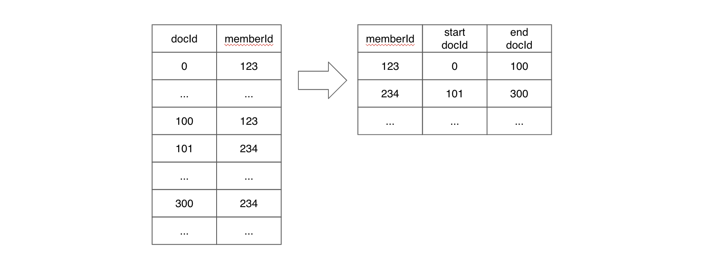

# Indexing

Pinot 支持以下[索引](https://docs.pinot.apache.org/basics/indexing)技术：
- [正排索引](#正排索引)
    - Dictionary-encoded forward index with bit compression
    - Raw value forward index
    - Sorted forward index with run-length encoding
- [倒排索引](#倒排索引)
    - Bitmap inverted index
    - Sorted inverted index
- Star-tree Index
- [Bloom Filter]()
- [Range Index]()
- Text Index
    - [Native Text Index]()
    - [Text Search Support]()
- Geospatial
- [JSON Index]()
- [Timestamp Index]()

每一种索引技术在不同的场景中都有各自的优势。默认情况下，Pinot 为每一列创建一个 dictionary-encoded forward index 。

## 启用索引
要为一个 Pinot 表创建索引有两种方式：

### 1. 在 Pinot 分段(segment)生成期间，作为摄取(ingestion)的一部分

通过在表配置中指定希望添加索引的列名来启用索引。可以在 [Table Config](https://docs.pinot.apache.org/configuration-reference/table) 部分以及下面小节中查看如何配置各种类型索引的更多细节。

### 2. 动态地添加或删除索引
索引也可以动态地在任何 pinot 分段中添加或删除，更新表配置到你需要的最新的索引集。

例如，如果你已经为 `foo` 列添加了倒排索引，并且现在想为 `bar` 列也添加相同的索引，你可以将表配置从下面这样：

```
"tableIndexConfig": {
    "invertedIndexColumns": ["foo"],
    ...
}
```

更新成这样：

```
"tableIndexConfig": {
    "invertedIndexColumns": ["foo", "bar"],
    ...
}
```

更新的索引配置需要在调用了 reload API 之后生效。这个 API 通过 Helix 将重新加载的信息发送到所有服务器，作为从本地分段添加或删除索引的一部分。这个改变不需要任何停机时间并且对查询完全透明。

当添加一个索引时，只有这个新的索引会被创建并且添加到现有的分段上。当删除一个索引时，该索引相关的状态会被从 Pinot 服务器一起清除。

你可以在 Swagger 页面的 Segments 部分中找到 reload API ：

```
curl -X POST \
  "http://localhost:9000/segments/myTable/reload" \
  -H "accept: application/json"
```

也可以在 Pinot UI 的[集群管理器](https://docs.pinot.apache.org/basics/components/exploring-pinot#cluster-manager)的特定表页面中找到该动作。

> 并非所有的索引都可以回顾性地应用于现有的分段。有关应用索引的更详细文档，请参阅 [Indexing FAQ](https://docs.pinot.apache.org/basics/getting-started/frequent-questions/ingestion-faq#indexing) 。

## 调整索引

对大部分用例来说，倒排索引提供了很好的性能，特别是你的用例没有严格的低延迟的需求时。

你应该首先尝试倒排索引，如果你觉得查询不够快速时，可以切换到高级索引，如排序索引或星树索引。

# 正排索引

每一列的值都存储在一个正排索引中，正排索引有三种类型:

- [Dictionary encoded forward index](#位压缩字典编码正排索引（默认）)

    构建一个将唯一 id 映射到列中的每个唯一值的字典，以及包含位压缩 id 的正排索引。

- [Sorted forward index](#运行时长度编码排序正排索引)

    构建一个将每个唯一值映射到一个 start-end document id 对的字典，以及在字典编码上的正排索引。

- [Raw value forward index](#原始值正排索引)

    直接根据列值构建正排索引。

为了节省 segment 存储空间，现在可以在创建表时[禁用](#禁用正排索引)正排索引。

## 位压缩字典编码正排索引（默认）

一列中的每一个唯一值都会被分配一个 id ，并且创建一个字典来映射 id 到唯一值。正排索引会存储位压缩后的 ids 而不是值本身。如果这一列只有很少的唯一值，那么字典编码可以显著提高空间效率。

下面的图片展示了为 `integer` 和 `string` 类型的两列创建的字典编码。对 `colA` 来说，字典编码为重复值节省了大量空间。

而对 `colB` 来说，可以看到该列没有重复的数据，在列中有很多唯一值的情况下，字典编码的压缩作用就不明显了；并且对于 `string` 类型，Pinot 选择最长字符串的长度作为字典的定长数组的值的长度，因此如果一个字符串列有大量的唯一值，填充开销就会很高。


## 运行时长度编码排序正排索引

当一个列被物理排序时，Pinot 在字典编码的基础上使用运行时长度编码排序正排索引。Pinot 将为每个值存储一对开始和结束文档 id ，而不是为每个文档 id 保存字典 id 。



为简单起见，上图不包括字典编码层。

排序正排索引同时具有良好的压缩和数据局部性的优点。排序正排索引也可以用作倒排索引。

### Real-time tables

在表配置中设置排序索引：

```
{
    "tableIndexConfig": {
        "sortedColumn": [
            "column_name"
        ],
        ...
    }
}
```

> **注意：** 一个 Pinot 表只能有一个排序的列。

实时数据摄取将在生成分段(segment)时根据 `sortedColumn` 对数据进行排序 - 你不需要预先对数据进行排序。

当提交一个分段时，Pinot 将传递每个列中的数据，并为包含排序数据的所有列创建一个排序索引，即使它们没有指定为 `sortedColumn` 。

### Offline tables

对于离线数据摄取，Pinot 将传递每个列中的数据，并为包含已排序数据的列创建排序索引。这意味着，如果你希望某一列具有排序索引，则需要在将数据摄取到 Pinot 之前按该列对数据进行排序。

如果你正在摄取多个分段(segments)的数据，需要确保数据在每个段内已排好序 - 你不需要跨分段对数据进行排序。

### 检查排序状态

你可以运行以下命令查看分段中某列的排序状态：

```sh
$ grep memberId <segment_name>/v3/metadata.properties | grep isSorted
column.memberId.isSorted = true
```

另外，对于离线表以及实时表中的已提交段，你可以从 `getServerMetadata` 端点检索排序状态。以 [Batch Quick Start](https://docs.pinot.apache.org/basics/getting-started/quick-start#batch) 为例:

```
curl -X GET \
  "http://localhost:9000/segments/baseballStats/metadata?columns=playerID&columns=teamID" \
  -H "accept: application/json" 2>/dev/null | \
  jq -c '.[] | . as $parent |  .columns[] | [$parent .segmentName, .columnName, .sorted]'
```

```
["baseballStats_OFFLINE_0","teamID",false]
["baseballStats_OFFLINE_0","playerID",false]
```

## 原始值正排索引

原始值正排索引直接存储值而不是 ids 。

如果没有字典，每次取值时都可以跳过字典查找步骤；此外，索引还可以利用值的良好局部性，从而提高扫描大量值的性能。

原始值正排索引适用于具有大量唯一值的列，这种情况下字典编码没能提供太多压缩效率。

如下图所示，使用字典编码将需要大量随机访问内存来进行字典查找；而使用原始值正排索引，可以按顺序扫描值，如果应用得当，可以提高查询性能。


可以在 [table config](https://docs.pinot.apache.org/configuration-reference/table) 中配置原始值正排索引：

```
{
    "tableIndexConfig": {
        "noDictionaryColumns": [
            "column_name",
            ...
        ],
        ...
    }
}
```

## 字典编码 vs 原始值

当确定一个列应该使用字典编码还是原始值编码时，可以参考下面的比较表格：

字典编码  | 原始值
----  | ----
在低到中等基数时提供压缩  | 消除填充开销
允许索引（特别是 inv 索引）  | 没有 inv 索引（只有 JSON/Text/FST 索引）
增加了一级解引用，所以增加了磁盘寻径开销 | 消除了额外的解引用，所以当要搜索的文档连续时性能很好
对于字符串，填充以使字典中的所有值都等长 | 所选文档的块解压开销没有空间局部性

## 禁用正排索引

一般来说，正排索引是所有磁盘分段(segment)文件格式中所有列上的强制索引。

但是，某些列只作为所有查询的 `WHERE` 子句中的筛选使用。在这种情况下，正排索引是不必要的，因为分段中的其他索引和结构可以提供所需的 SQL 查询功能。正排索引在这种情况下只会占用额外的存储空间，理想情况下可以将其释放。

因此，为了给用户提供一个节省存储空间的选项，现在可以选择禁用正排索引。

Pinot 表中一个或多个列上的正排索引可以被禁用，但是有以下限制：

- 仅支持不可变（offline）分段。
- 如果该列上有范围索引，那么要求该列必须为 single-value 类型并且范围索引使用版本2。
- 在一行中有副本的 MV 列会在重新生成正排索引时丢失掉重复的条目；MV 行的数据顺序也会在重新生成索引时发生变化。因此在这种场景下，需要回填（以保存副本或数据顺序）。
- 如果需要在重载时支持再次生成正排索引（即为禁用了正排索引的列重新启用正排索引），则必须在该列上启用字典和倒排索引。

### Select

### Group By & Order By

### Aggregation Queries

### Distinct

### Range Queries

# 倒排索引