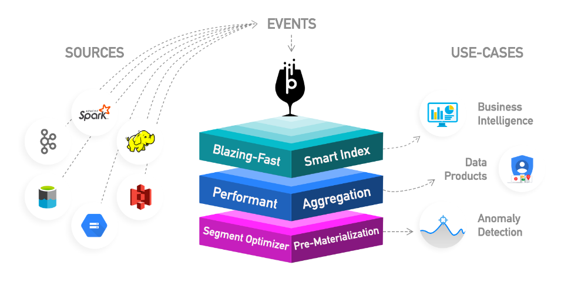

# Introduction

Pinot 是一个实时的分布式的在线分析处理（OnLine Analytical Processing, OLAP）数据存储，专门用于提供高吞吐量下的超低延迟的分析。它可以**直接从流 (streaming) 数据源，例如 Apache Kafka 和 Amazon Kinesis，获取 (ingest) 数据并且实现实时查询**。它也可以从批 (batch) 数据源，例如 Hadoop HDFS、Amazon S3、Azure ADLS 和 Google Cloud Storage，获取 (ingest) 数据。

Pinot 系统的核心是列式 (columnar) 的存储，以及为了实现低延迟而使用的智能索引和预聚合技术。**这使得 Pinot 非常适合面向用户的实时分析**。同时，Pinot 也是内部仪表板、异常检测和特定数据探索等其他分析场景的一个很好的选择。



Pinot 的设计使得它可以无限的向外扩展，基于集群的大小和预期的每秒查询（QPS）阈值，性能始终保持不变。

> **在 YouTube 中观看**\
> [What is Apache Pinot? (and User-Facing Analytics) by Tim Berglund](https://youtu.be/\_lqdfq2c9cQ)

### 面向用户的实时分析

**面向用户的分析**，或面向站点的分析，是指**直接面向产品最终用户的分析工具和应用程序**。在面向用户分析的应用程序中，用户群指是应用的所有最终用户，而不仅仅是公司中少数进行离线分析的分析师或运行特定查询的数据科学家。每个终端用户在他们的个人设备上收到个性化的分析（**想象一下每秒数十万个查询**）；因为这些查询是由应用程序触发的，不是由人写的，所以规模与应用程序上的活跃用户一样大（**想象一下每秒数百万个事件**）。

这些查询针对所有可能的最新数据，这涉及到另一个方面 — **实时分析**。对某些用例来说，昨天的数据不再有用，数据需要在生成时就可以用于分析（**考虑 1 秒内的延迟**）。

### 为什么面向用户的实时分析如此具有挑战性?

面向用户的实时分析应用程序对底层架构来说意味着什么?


* 这类应用需要尽可能新的数据，因此系统需要能够**实时地接收 (ingest) 数据，并提供实时查询**。
* 这类应用的数据往往是来自多个来源的广泛的操作事件数据，所以数据**以非常高的速度进入，而且往往是高维的**。
* 查询是由终端用户与应用的交互触发的 — 需要支持**每秒数十万查询**，**任意查询模式**和**以毫秒为单位的延迟**以获得良好的用户体验。
* 这类应用还需要具有**可扩展性**、可靠性、高可用性和低成本。

> **在 YouTube 中观看**\
> 面向用户的实时分析和 Pinot 的功能：[Using Kafka and Pinot for Real-Time User-Facing Analytics](https://www.youtube.com/watch?v=L5b\_OJVOJKo\&t=576s)\
> Pinot 如何处理面向用户的分析中所面临的一些挑战：[Building Latency Sensitive User-facing Analytics via Apache Pinot](https://youtu.be/JV0WxBwJqKE)

### 使用 Pinot 的公司

LinkedIn，Pinot 的发源地，目前拥有最大的 Pinot 部署之一，支持超过 50 个面向用户的应用程序（如查看我的个人资料，人才分析，公司分析，广告分析等）。在 LinkedIn 中，Pinot 还充当后端来可视化和监控 10,000 多个业务指标。

Pinot 还支持其他几个大公司的各种实时分析用例，包括 Uber、沃尔玛、WePay、Factual、微博等。使用 Pinot 的公司的详细名单可以在[这里](https://pinot.apache.org/who\_uses)找到。

### 特性

* 一个具有各种压缩方案（如运行长度和固定的位长度）的面向列的数据库
* 可插拔的[索引技术](basics/indexing/)
* 能够基于查询和分段元数据优化查询和执行计划
* 等流的近实时接收，以及来自 Hadoop、S3、Azure、GCS 等源的批量接收
* 类 SQL 语言，支持对数据的选择、聚合、过滤、分组、排序和唯一 (distinct) 查询
* 支持多值 (multi-valued) 字段
* 横向可扩展和容错

## 什么时候应该使用 Pinot ?

Pinot 设计用于执行低延迟的 OLAP 查询，它在需要快速分析的地方工作得很好，比如对不可变 (immutable) 数据进行聚合。

**面向用户的分析产品**

Pinot 是面向用户的分析产品的完美选择。Pinot 最初是在 LinkedIn 上构建的，用于支持富交互的实时分析应用程序，如 [谁看了我](https://www.linkedin.com/me/profile-views/urn:li:wvmp:summary/)，[公司分析](https://www.linkedin.com/company/linkedin/insights/)，[人才见解](https://business.linkedin.com/talent-solutions/talent-insights) 等等。[UberEats Restaurant Manager](https://eng.uber.com/restaurant-manager/) 是另一个用 Pinot 构建的面向用户的分析应用。

**用于业务指标 (metrics) 的实时仪表盘**

Pinot 还可以用于在大规模多维数据上执行 **slice and dice**、**drill down**、**roll up**、**pivot** 等典型的分析操作。例如，在 LinkedIn，Pinot 为包含数千个业务指标的 dashboards 提供支持。还可以连接各种 BI 工具，如 Superset、Tableau 或 PowerBI，以可视化 Pinot 中的数据。

Pinot 与 Superset 的连接说明可以在[这里](https://docs.pinot.apache.org/integrations/superset)找到。

**异常检测**

除了将 Pinot 中的数据可视化之外，还可以运行机器学习算法来检测存储在 Pinot 中的数据中的异常情况。有关如何使用 Pinot 进行异常检测和根本原因分析的更多信息，请参阅 [ThirdEye](https://docs.pinot.apache.org/integrations/thirdeye) 。

### 入门常见问题

#### **Pinot 是数据仓库还是数据库 ?**

虽然 Pinot 不符合数据库产品的典型模式，但最好根据分析师、数据科学家或应用程序开发人员的角色来理解它。

**企业业务智能化**

对于分析师和数据科学家来说，Pinot 最好被视为一个高度可扩展的商业智能数据平台。从这个角度来看，Pinot 将大数据平台与数据仓库的传统角色融合在一起，使其成为分析和报告的合适替代品。

**企业应用开发**

对于应用程序开发人员来说，Pinot 最好被视为一个不可变的聚合存储，它从流数据源（如 Kafka）中获取事件，并使其可用于使用 SQL 进行查询。

与微服务架构一样，数据封装最终要求每个应用程序提供自己的数据存储，而不是共享一个 OLTP 数据库进行读写。在这种情况下，查询一个域的完整视图变得很困难，因为它存储在许多不同的数据库中。就性能而言，这是代价高昂的，因为它需要跨多个微服务连接，这些微服务在 REST API 下通过 HTTP 公开它们的数据。为了防止这种情况，可以使用 Pinot 将微服务架构中的所有数据聚合到一个易于查询的域视图中。

Pinot [tenants](https://docs.pinot.apache.org/basics/components/tenant) 阻止了在微服务团队之间共享数据库表所有权的任何可能性。开发人员可以根据自己的用例和需求，从多个记录系统中创建自己的数据查询模型。与所有聚合存储一样，查询模型最终是一致且不可变的。

### 入门指南

如果你刚刚接触 Pinot 并且想要通过示例学习如何使用，可以查看：

* [Getting Started](https://docs.pinot.apache.org/basics/getting-started)

如果你想开始学习将数据导入 Pinot，请查看我们基于[插件](https://docs.pinot.apache.org/developers/plugin-architecture)的批量导入和流接收指南：

* [Import Data](https://docs.pinot.apache.org/basics/data-import)

### 查询示例

Pinot 非常适用于在一个巨大无界的记录上查询具有多个维度和指标的时间序列数据，这些记录空间在每个节点上呈线性扩展。过滤和聚合查询可以做到既简单又快速。

```sql
SELECT sum(clicks), sum(impressions) FROM AdAnalyticsTable
  WHERE 
       ((daysSinceEpoch >= 17849 AND daysSinceEpoch <= 17856)) AND 
       accountId IN (123456789)
  GROUP BY 
       daysSinceEpoch TOP 100
```

Pinot 支持 SQL 查询只读数据。在我们的 [PQL (Pinot Query Language)](https://docs.pinot.apache.org/users/user-guide-query/querying-pinot) 指南中了解更多关于查询 Pinot 时间序列数据的信息。

## 安装

Pinot 可以部署到云、本地或虚拟机并在其上进行操作。你可以从 bare-metal 安装或 Kubernetes 安装（本地或云中）开始。要立即开始使用 Pinot，请查看如下使用 Docker 或 Kubernetes 部署 Pinot 集群的快速开始指南。

### 单例模式

* [Running Pinot locally](https://docs.pinot.apache.org/basics/getting-started/running-pinot-locally)
* [Running Pinot in Docker](https://docs.pinot.apache.org/basics/getting-started/running-pinot-in-docker)

### 集群模式

* [Running in Kubernetes](https://docs.pinot.apache.org/basics/getting-started/kubernetes-quickstart)
