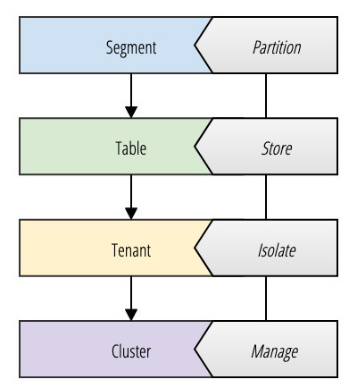

# Concepts

Pinot 旨在为大型数据集提供低延迟查询。为了实现这一性能，Pinot 以列 (columnar) 格式存储数据，并添加额外的索引来执行快速过滤 (filtering) 、聚合 (aggregation) 和分组 (group by) 。

原始数据 (raw data) 被分解成小的数据碎片，每个碎片被转换成一个称为分段 ([segment](https://docs.pinot.apache.org/pinot-components/segment)) 的单位。一个或多个分段一起形成一个表 ([table](https://docs.pinot.apache.org/pinot-components/table)) ，表是使用 [SQL/PQL](https://docs.pinot.apache.org/user-guide/user-guide-query/pinot-query-language) 查询 Pinot 的逻辑容器。

Pinot 使用了各种各样的术语，这些术语既包括数据[存储模型](#Pinot-Storage-Model)的抽象，也包括驱动系统功能的基础设施[组件](#Pinot-Components)。

## Pinot Storage Model

### Segment

Pinot 有一个支持横向扩展的分布式系统架构。Pinot 预计一张表的大小会随着时间无限增长，为了实现这一点，数据需要分布在多个节点上。Pinot 通过将数据分解成更小的块 (chunks) ，Pinot 中称为分段 ([segments](https://docs.pinot.apache.org/basics/components/segment)) - 类似于 HA 关系数据库中的 shards/partitions，来实现这一点。分段也可以看作是基于时间的分区 (partitions) 。

### Table

与传统数据库相同，Pinot 有表 ([table](https://docs.pinot.apache.org/pinot-components/table)) 的概念：一个指向相关数据集合的逻辑抽象。

与 RDBMS 相同，表是由可以使用 SQL 查询的列和行 (documents) 组成的结构。表与模式 ([schema](https://docs.pinot.apache.org/basics/components/schema)) 相关联，在模式定义表中的列及其数据类型。与 RDBMS 模式相比，Pinot 中的多个表 (real-time or batch) 可以继承单个模式定义。表是根据索引 (indexing) 策略、分区 (partitioning) 、租户 (tenants) 、数据源 (data sources) 、以及主从复制 (replication) 等问题独立配置的。

### Tenant

为了支持多用户，Pinot 为租户 ([tenants](https://docs.pinot.apache.org/basics/components/tenant)) 提供了非常好的支持。表与租户相关联，这允许属于特定逻辑命名空间的所有表被分组在同一个租户名称下，并与其他租户隔离。租户之间的这种隔离为应用程序和团队提供了不同的命名空间，以防止共享表或模式。构建应用程序的开发团队不需要将 Pinot 独立部署。一个组织可以操作单个集群 (cluster) ，并为因增加新租户而增加总体查询量向外扩展；开发人员可以管理自己的模式和表，而不受集群上任何其他租户的影响。

默认情况下，所有表都属于一个名为 “default” 的默认租户。租户的概念非常重要，因为它在不需要操作许多独立的数据库的情况下满足了 “database per service/application” 的架构原则。此外，租户将调度资源，以便分段 (shards) 能够限制表的数据只保存在指定的节点 (nodes) 上。与 Linux 容器中普遍使用的隔离 (isolation) 类似，可以调度 Pinot 中的计算资源，以防止租户之间的资源争用。

### Cluster

从逻辑上讲，一个集群 ([cluster](https://docs.pinot.apache.org/basics/components/cluster)) 就是一组租户的集合。与集群的经典定义一样，它也是一堆计算节点的分组。通常，每个环境/数据中心只有一个集群。由于 Pinot 支持租户的概念，因此不需要创建多个集群。在 LinkedIn ，最大的 Pinot 集群由分布在数据中心的 1000 多个节点组成。集群中的节点数量可以增加以线性增加查询的性能和可用性。节点数量和每个节点的计算资源将可靠地预测 Pinot 集群的 QPS ，因此，可以使用 SLAs 轻松实现容量规划，来准确地为终端用户应用程序的性能预期分配资源。

> 自动伸缩 (Auto-scaling) 也是可以实现的，但是，当查询负载在不可预测的终端用户使用场景中变化时，建议设置一定数量的节点以保持 QPS 一致。

## Pinot Components

Pinot 集群由多个分布式系统组件组成。对于监控系统使用情况或调试集群部署问题的操作人员来说，了解这些组件非常有用。

- 控制器 (Controller)
- 代理/中介 (Broker)
- 服务器 (Server)
- Minion (optional)

通过与 [Apache Zookeeper](https://zookeeper.apache.org/) 以及 [Apache Helix](http://helix.apache.org/) 的集成，使Pinot 能够线性扩展到无限数量的节点。

> Helix 是一个集群管理解决方案，由 Pinot 在 LinkedIn 的作者设计和创建。Helix 驱动 Pinot 集群从瞬时 (transient) 状态转变到理想 (ideal) 状态，充当容错的分布式状态存储来保证一致性。Helix 作为嵌入的代理 (agents) 在控制器 (controller) 、中介 (broker) 和服务器 (server) 中发挥作用，而不是作为独立的水平扩展组件存在。

### Pinot Controller

控制器 ([controller](https://docs.pinot.apache.org/basics/components/controller)) 是管理 Pinot 集群一致性和路由的核心协调器。控制器作为一个独立的组件（容器）可以横向伸缩，并且了解集群中所有其他组件的状态。控制器对系统中的状态变化做出反应和响应，并为表、段或节点分配资源。如前所述，Helix 作为一个代理嵌入到控制器中，负责观察和驱动其他组件所订阅的状态的更改。

除了集群管理、资源分配和调度之外，控制器还作为 HTTP gateway 用于 Pinot 的 REST API 。Pinot 还提供了基于 web 的查询控制台，便于操作人员快速轻松地运行 SQL/PQL 查询。

### Pinot Broker

代理 ([Broker](https://docs.pinot.apache.org/basics/components/broker)) 从客户端接收查询，并将查询路由到一个或多个Pinot 服务器执行，然后返回统一响应。

### Pinot Server

服务器 ([Server](https://docs.pinot.apache.org/basics/components/server)) 管理跨多个节点调度和分配的分段（分片），并被路由到一个租户（默认情况下只有一个租户）。服务器是可以水平扩展的独立容器，控制器驱动的 Helix 会通知它状态的变化。服务器可以是实时 (real-time) 服务器，也可以是离线 (offline) 服务器。

实时 (real-time) 服务器和离线 (offline) 服务器有非常不同的资源使用需求，实时服务器不断地消费来自外部系统（如 Kafka topics）的新消息，这些消息被摄取 (ingest) 并分配给租户的各个分段。正因如此，资源隔离可用于对接收的高吞吐量实时数据流进行优先级排序，然后通过代理 (broker) 提供查询。

### Pinot Minion

Pinot [Minion](https://docs.pinot.apache.org/basics/components/minion) 是一个可选组件，可用于运行后台任务，如 GDPR（通用数据保护条例）的“清洗”。由于 Pinot 是一个不可变的聚合存储，因此包含敏感私有数据的记录需要在逐个请求上被清除。Minion 为此提供了一种符合 GDPR 的解决方案，同时优化了 Pinot 分段并构建额外的索引以保证在数据可能被删除的情况下的性能。还可以编写定期运行的自定义任务。虽然可以直接在 Pinot 服务器上执行这些任务，但拥有一个单独的进程 (Minion) 可以减少整体的查询延迟，因为分段会受到可变写入的影响。