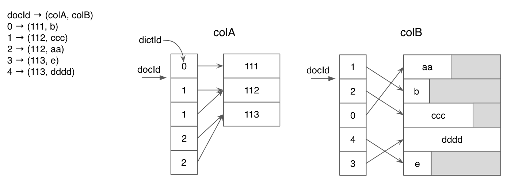
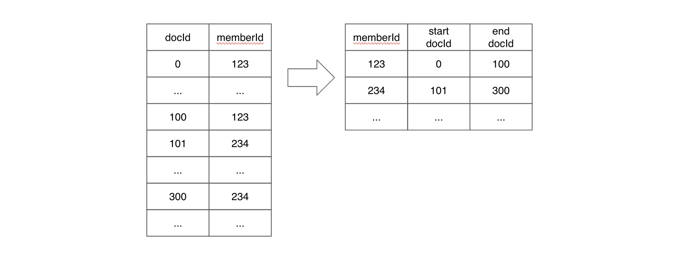
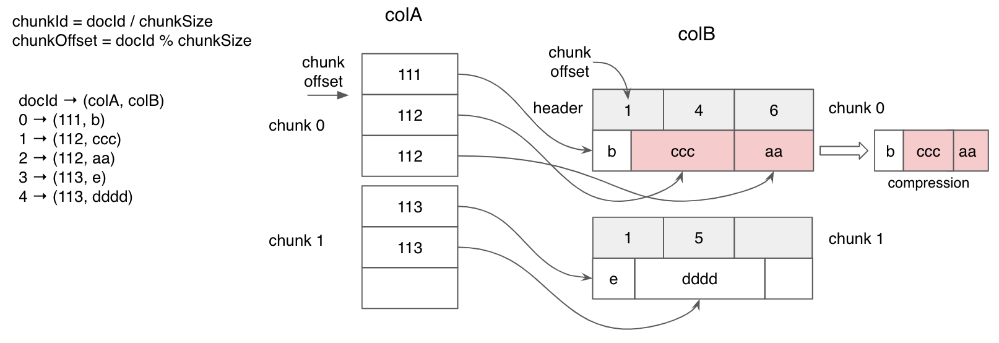
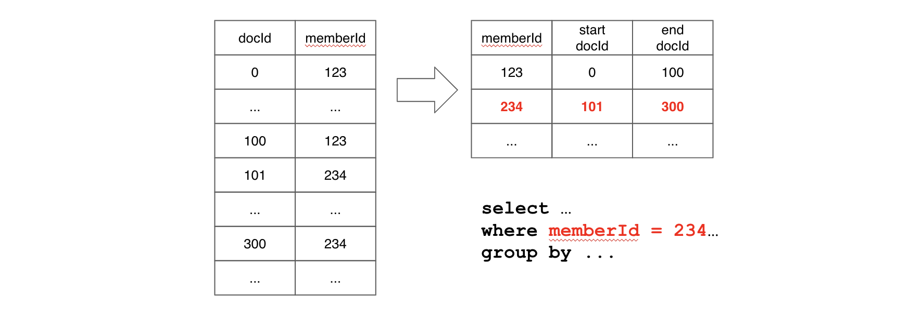

# Indexing

Pinot 支持以下[索引](https://docs.pinot.apache.org/basics/indexing)技术：
- [Forward Index](#正排索引)
    - Dictionary-encoded forward index with bit compression
    - Raw value forward index
    - Sorted forward index with run-length encoding
- [Inverted Index](#倒排索引)
    - Bitmap inverted index
    - Sorted inverted index
- Star-tree Index
- [Bloom Filter](#布隆过滤器)
- [Range Index](#范围索引)
- Text Index
    - [Native Text Index](#本地文本索引)
    - [Text Search Support](#文本搜索支持)
- Geospatial
- [JSON Index](#JSON-Index)
- [Timestamp Index](#时间戳索引)

每一种索引技术在不同的场景中都有各自的优势。默认情况下，Pinot 为每一列创建一个字典编码正排索引。

## 启用索引
要为一个 Pinot 表创建索引有两种方式：

### 1. 在 Pinot 分段生成期间，作为摄取 (ingestion) 的一部分
通过在表配置中指定希望添加索引的列名来启用索引。可以在 [Table Config](https://docs.pinot.apache.org/configuration-reference/table) 部分以及下面小节中查看如何配置各种类型索引的更多细节。

### 2. 动态地添加或删除索引
索引也可以动态地在任何 pinot 分段中添加或删除，更新表配置到你需要的最新的索引集。

例如，如果你已经为 `foo` 列添加了倒排索引，并且现在想为 `bar` 列也添加相同的索引，你可以将表配置从下面这样：

```
"tableIndexConfig": {
    "invertedIndexColumns": ["foo"],
    ...
}
```

更新成这样：

```
"tableIndexConfig": {
    "invertedIndexColumns": ["foo", "bar"],
    ...
}
```

更新的索引配置需要在调用了 reload API 之后生效。这个 API 通过 Helix 将重新加载的信息发送到所有服务器，作为从本地分段添加或删除索引的一部分。这个改变不需要任何停机时间并且对查询完全透明。

当添加一个索引时，只有这个新的索引会被创建并且添加到现有的分段上。当删除一个索引时，该索引相关的状态会被从 Pinot 服务器一起清除。

你可以在 Swagger 页面的 Segments 部分中找到 reload API ：

```
curl -X POST \
  "http://localhost:9000/segments/myTable/reload" \
  -H "accept: application/json"
```

也可以在 Pinot UI 的[集群管理器](https://docs.pinot.apache.org/basics/components/exploring-pinot#cluster-manager)的特定表页面中找到该动作。

> 并非所有的索引都可以回顾性地应用于现有的分段。有关应用索引的更详细文档，请参阅 [Indexing FAQ](https://docs.pinot.apache.org/basics/getting-started/frequent-questions/ingestion-faq#indexing) 。

## 调整索引

对大部分用例来说，倒排索引提供了很好的性能，特别是你的用例没有严格的低延迟的需求时。

你应该首先尝试倒排索引，如果你觉得查询不够快速时，可以切换到高级索引，如排序索引或星树索引。

# 正排索引

每一列的值都存储在一个正排索引中，正排索引有三种类型:

- [Dictionary encoded forward index](#位压缩字典编码正排索引默认)

    构建一个将唯一 id 映射到列中的每个唯一值的字典，以及包含位压缩 id 的正排索引。

- [Sorted forward index](#运行时长度编码排序正排索引)

    构建一个将每个唯一值映射到一个 start-end document id 对的字典，以及在字典编码上的正排索引。

- [Raw value forward index](#原始值正排索引)

    直接根据列值构建正排索引。

为了节省分段存储空间，现在可以在创建表时[禁用](#禁用正排索引)正排索引。

## 位压缩字典编码正排索引（默认）

一列中的每一个唯一值都会被分配一个 id ，并且创建一个字典来映射 id 到唯一值。正排索引会存储位压缩后的 ids 而不是值本身。如果这一列只有很少的唯一值，那么字典编码可以显著提高空间效率。

下面的图片展示了为 `integer` 和 `string` 类型的两列创建的字典编码。对 `colA` 来说，字典编码为重复值节省了大量空间。

而对 `colB` 来说，可以看到该列没有重复的数据，在列中有很多唯一值的情况下，字典编码的压缩作用就不明显了；并且对于 `string` 类型，Pinot 选择最长字符串的长度作为字典的定长数组的值的长度，因此如果一个字符串列有大量的唯一值，填充开销就会很高。



## 运行时长度编码排序正排索引

当一个列被物理排序时，Pinot 在字典编码的基础上使用运行时长度编码排序正排索引。Pinot 将为每个值存储一对开始和结束文档 id ，而不是为每个文档 id 保存字典 id 。



为简单起见，上图不包括字典编码层。

排序正排索引同时具有良好的压缩和数据局部性的优点。排序正排索引也可以用作倒排索引。

### Real-time tables
在表配置中设置排序索引：

```
{
    "tableIndexConfig": {
        "sortedColumn": [
            "column_name"
        ],
        ...
    }
}
```

> **注意：** 一个 Pinot 表只能有一个排序的列。

实时数据摄取将在生成分段 (segment) 时根据 `sortedColumn` 对数据进行排序 - 你不需要预先对数据进行排序。

当提交一个分段时，Pinot 将传递每个列中的数据，并为包含排序数据的所有列创建一个排序索引，即使它们没有指定为 `sortedColumn` 。

### Offline tables
对于离线数据摄取，Pinot 将传递每个列中的数据，并为包含已排序数据的列创建排序索引。这意味着，如果你希望某一列具有排序索引，则需要在将数据摄取到 Pinot 之前按该列对数据进行排序。

如果你正在摄取多个分段 (segments) 的数据，需要确保数据在每个段内已排好序 - 你不需要跨分段对数据进行排序。

### 检查排序状态
你可以运行以下命令查看分段中某列的排序状态：

```sh
$ grep memberId <segment_name>/v3/metadata.properties | grep isSorted
column.memberId.isSorted = true
```

另外，对于离线表以及实时表中的已提交段，你可以从 `getServerMetadata` 端点检索排序状态。以 [Batch Quick Start](https://docs.pinot.apache.org/basics/getting-started/quick-start#batch) 为例:

```
curl -X GET \
  "http://localhost:9000/segments/baseballStats/metadata?columns=playerID&columns=teamID" \
  -H "accept: application/json" 2>/dev/null | \
  jq -c '.[] | . as $parent |  .columns[] | [$parent .segmentName, .columnName, .sorted]'
```

```
["baseballStats_OFFLINE_0","teamID",false]
["baseballStats_OFFLINE_0","playerID",false]
```

## 原始值正排索引

原始值正排索引直接存储值而不是 ids 。

如果没有字典，每次取值时都可以跳过字典查找步骤；此外，索引还可以利用值的良好局部性，从而提高扫描大量值的性能。

原始值正排索引适用于具有大量唯一值的列，这种情况下字典编码没能提供太多压缩效率。

如下图所示，使用字典编码将需要大量随机访问内存来进行字典查找；而使用原始值正排索引，可以按顺序扫描值，如果应用得当，可以提高查询性能。



可以在 [table config](https://docs.pinot.apache.org/configuration-reference/table) 中配置原始值正排索引：

```
{
    "tableIndexConfig": {
        "noDictionaryColumns": [
            "column_name",
            ...
        ],
        ...
    }
}
```

## 字典编码 vs 原始值

当确定一个列应该使用字典编码还是原始值编码时，可以参考下面的比较表格：

字典编码  | 原始值
----  | ----
在低到中等基数时提供压缩  | 消除填充开销
允许索引（特别是 inv 索引）  | 没有 inv 索引（只有 JSON/Text/FST 索引）
增加了一级解引用，所以增加了磁盘寻径开销 | 消除了额外的解引用，所以当要搜索的文档连续时性能很好
对于字符串，填充以使字典中的所有值都等长 | 所选文档的块解压开销没有空间局部性

## 禁用正排索引

一般来说，正排索引是所有磁盘分段 (segment) 文件格式中所有列上的强制索引。但是，某些列只作为所有查询的 `WHERE` 子句中的筛选使用。在这种情况下，正排索引是不必要的，因为分段中的其他索引和结构可以提供所需的 SQL 查询功能。正排索引在这种情况下只会占用额外的存储空间，理想情况下可以将其释放。

因此，为了给用户提供一个节省存储空间的选项，Pinot 现在可以选择禁用正排索引，但是有以下限制：

- 仅支持不可变（offline）分段。
- 如果该列上有范围索引，那么要求该列必须为 single-value 类型并且范围索引使用版本2。
- 在一行中有副本的 MV (multi-value) 列会在重新生成正排索引时丢失掉重复的条目；MV 行的数据顺序也会在重新生成索引时发生变化。因此在这种场景下，需要回填（以保存副本或数据顺序）。
- 如果需要在重载时支持再次生成正排索引（即为禁用了正排索引的列重新启用正排索引），则必须在该列上启用字典和倒排索引。

排序的列 (Sorted columns) 允许禁用正排索引，但此操作实际上无效并且仍会创建索引（它将同时用作正排索引和倒排索引
）。

要禁用给定列的正排索引，需要修改表配置中的 `fieldConfigList` ，如下所示:

```json
"fieldConfigList":[
  {
     "name":"columnA",
     "encodingType":"DICTIONARY",
     "indexTypes":["INVERTED"],
     "properties": {
        "forwardIndexDisabled": "true"
      }
  }
]
```

必须执行表重载 (reload) 操作才能使上述配置生效。启用/禁用列上的其他索引可以通过常用的[表配置](https://docs.pinot.apache.org/configuration-reference/table)选项完成。

相反，可以通过从 `fieldConfigList.properties` 中移除 `forwardIndexDisabled` 属性并重新加载分段来重新生成被禁用的正排索引。只有在为列启用了字典和倒排索引时，才能重新生成正排索引。如果其中一个被禁用，那么生成正排索引的唯一方法是通过离线作业 (offline jobs) 重新生成分段并重新推送/刷新数据。

> **警告:** <br/>
对于多值 (MV) 列，在为禁用了正排索引的列重新生成正排索引后，以下不变量 (invariants) 不能被维护：<li>一行中 MV 值的顺序保证</li><li>如果一个 MV 行中的项有副本，副本将丢失；请通过离线作业重新生成分段，并重新推送/刷新数据，以获得带有副本的原始 MV 数据。</li>
我们将在未来努力去除第二个不变量。

### 不支持的查询
假如禁用了列 `columnA` 的正排索引将导致如下的查询失败：

#### Select
即使在 `columnA` 上添加了筛选器 (filters) ，禁用了正排索引的列也不能出现在 `SELECT` 子句中。

失败示例：

```SQL
SELECT columnA
FROM myTable
WHERE columnA = 10
```

```SQL
SELECT *
FROM myTable
```

#### Group By & Order By
在 `GROUP BY` 和 `ORDER BY` 子句中不能出现禁用了正排索引的列。它们也不能成为 `HAVING` 从句的一部分。

失败示例：

```SQL
SELECT SUM(columnB)
FROM myTable
GROUP BY columnA
```

```SQL
SELECT SUM(columnB), columnA
FROM myTable
GROUP BY columnA
ORDER BY columnA
```

```SQL
SELECT MIN(columnA)
FROM myTable
GROUP BY columnB
HAVING MIN(columnA) > 100
ORDER BY columnB
```

#### Aggregation Queries
当正排索引被禁用时，聚合函数的一个子集可以工作，例如 `MIN` ，`MAX` ，`DISTINCTCOUNT` ，`DISTINCTCOUNTHLL` 等等；其他聚合函数将不能工作，如下面所示。

失败示例：

```SQL
SELECT SUM(columnA), AVG(columnA)
FROM myTable
```

```SQL
SELECT MAX(ADD(columnA, columnB))
FROM myTable
```

#### Distinct
禁用正排索引的列不能出现在 `SELECT DISTINCT` 子句中。

失败示例：

```SQL
SELECT DISTINCT columnA
FROM myTable
```

#### Range Queries
要在筛选 (filter) 子句包含 `>` 、`<` 、`>=` 、`<=` 等操作符的单值列上运行查询，必须提供版本2的范围索引。如果没有范围索引，下面的查询将失败：

```SQL
SELECT columnB
FROM myTable
WHERE columnA > 1000
```

# 倒排索引

## Bitmap inverted index

当为列启用倒排索引时，Pinot 维护从每个值到行位图 (bitmap) 的映射，这使得值查找仅需要花费常量 (constant) 时间。如果你有一个经常用于过滤 (filtering) 的列，那么添加倒排索引将大大提高性能。

倒排索引可以通过在表配置做如下设置来添加:

```json5
{
    "tableIndexConfig": {
        "invertedIndexColumns": [
            "column_name",
            ...
        ],
        ...
    }
}
```

## Sorted inverted index

倒排索引可以直接使用排序正排索引 (sorted forward index) ，查找时间为 `log(n)` ，并且可以从数据局部性中获益。

对于下面的示例，如果查询在 `memberId` 上有过滤，Pinot 将对 `memberId` 值执行二分 (binary) 搜索，以找到对应过滤值的 `docid` 对。如果查询在过滤后需要扫描其他列的值，那么 `docId` 对范围内的值将被定位在一起，这意味着我们可以从数据局部性中获益。



排序索引的性能要比倒排索引好得多，但它只能应用于每个表的一个列上。当使用倒排索引的查询性能不够好，并且大多数查询都是在同一列上进行过滤 (e.g. memberId) 时，排序索引可以提高查询性能。

# 布隆过滤器

Bloom Filter 帮助剔除那些不包含任何满足 `EQUALITY` 谓词的条目的分段。

它在如下查询中有用：

```SQL
SELECT COUNT(*) 
FROM baseballStats 
WHERE playerID = 12345
```

布隆过滤器有 3 个配置参数：
- `fpp` : False Positive Probability (from 0 to 1，默认为 0.05) ；fpp 越低，过滤器的准确度越高，但是同时会增加占用的空间。
- `maxSizeInBytes` : Maximum size (默认不受限制) ；如果某个 fpp 生成的过滤器大小大于该最大值，Pinot 将调大 fpp 以使过滤器大小保持在此限制内。
- `loadOnHeap` : 是否使用堆内存 (heap) 或堆外 (off-heap) 内存加载布隆过滤器 (默认为 false) 。

有两种方法在表配置中配置布隆过滤器:

1. 默认设置

```json5
{
  "tableIndexConfig": {
    "bloomFilterColumns": [
      "playerID",
      ...
    ],
    ...
  },
  ...
}
```

2. 自定义参数

```json5
{
  "tableIndexConfig": {
    "bloomFilterConfigs": {
      "playerID": {
        "fpp": 0.01,
        "maxSizeInBytes": 1000000,
        "loadOnHeap": true
      },
      ...
    },
    ...
  },
  ...
}
```

# 范围索引

范围索引帮助你在涉及范围筛选的查询中获得更好的性能。它将对如下的查询有帮助：

```SQL
SELECT COUNT(*) 
FROM baseballStats 
WHERE hits > 11
```

范围索引是倒排索引的一种变体，在倒排索引中，我们创建的不是从值到列的映射，而是从值的范围到列的映射。可以在表配置中添加如下配置来使用范围索引：

```json5
{
    "tableIndexConfig": {
        "rangeIndexColumns": [
            "column_name",
            ...
        ],
        ...
    }
}
```

字典编码和原值编码列都支持范围索引。

## 什么时候应该使用范围索引？

一个好的经验法则是，当你想对具有大量唯一值的度量 (metric) 列应用范围谓词 (predicates) 时，为此列添加范围索引。如果为这些列添加倒排索引将创建一个非常大的索引，这在存储和性能方面都是低效的。

# 本地文本索引

## Pinot 中文本索引与搜索的历史
Pinot 通过为主要分段构建 Lucene 索引，作为 “sidecars” ，来支持文本索引和搜索。虽然这是一项很棒的技术，但它本质上限制了针对 Pinot 特定的文本搜索用例进行优化的途径。

## Pinot 搜索场景有什么不同？
Pinot，或任何其他 database/OLAP 引擎，是不需要遵守传统上由 FTS 引擎（如 ElasticSearch 和 Solr）使用的整个全文搜索 DSL 的。传统的 SQL 文本搜索用例中，大多数文本搜索由三种模式组成：前缀通配符 (prefix wildcard) 查询、后缀通配符 (postfix wildcard) 查询和术语 (term) 查询。

## Pinot 中的本地文本索引
本地文本索引是从头开始构建的，使用一个自定义的文本索引引擎，加上 Pinot 强大的倒排索引，以提供超快速的文本搜索体验。

## 本地文本索引的优势
对于上面提到的文本搜索用例，本地文本索引比基于 Lucene 的索引快 80-120% ，占用的磁盘空间也小了 40% 。

## 实时索引和搜索
本地文本索引支持的一个新特性是实时文本搜索。对于 REALTIME 表，本地文本索引允许在内存中对数据进行索引，同时支持在该索引上进行文本搜索。

从历史上看，大多数文本索引都依赖于先写入内存中的文本索引，然后封好 (sealed) ，然后才能进行搜索。这限制了搜索的新鲜度，最多只能接近实时。

本地文本索引带有一个自定义的内存文本索引，允许实时索引和搜索。

## 搜索本地文本索引

引入一个新函数 `TEXT_CONTAINS` ，用于支持在本地文本索引上进行文本搜索。

```SQL
SELECT COUNT(*) FROM Foo WHERE TEXT_CONTAINS (<column_name>, <search_expression>)
```

示例：

```SQL
SELECT COUNT(*) FROM Foo WHERE TEXT_CONTAINS (<column_name>, "foo.*")
SELECT COUNT(*) FROM Foo WHERE TEXT_CONTAINS (<column_name>, ".*bar")
SELECT COUNT(*) FROM Foo WHERE TEXT_CONTAINS (<column_name>, "foo")
```

`TEXT_CONTAINS` 可以使用标准布尔运算符进行组合：

```SQL
SELECT COUNT(*) FROM Foo WHERE TEXT_CONTAINS ("col1", "foo") AND TEXT_CONTAINS ("col2", "bar")
```

注意，`TEXT_CONTAINS` 目前支持正则表达式和术语查询，而且只能在本地索引上工作。

注意，`TEXT_CONTAINS` 支持标准正则表达式模式 (regex patterns) ，如 SQL 标准查询中 LIKE 所使用的那样，所以可能与从 Lucene 查询有一些句法变化。

## 创建本地文本索引
本地文本索引是 Pinot 支持的一种文本搜索索引，因此使用常规的表配置方式创建。为了表明索引类型是本地 (native) 的，需要在 fieldConfig 中指定一个额外的 property ：

```json
"fieldConfigList":[
  {
     "name":"text_col_1",
     "encodingType":"RAW",
     "indexTypes": ["TEXT"],
     "properties":{"fstType":"native"}
  }
]
```

# 文本搜索支持

## 为什么需要文本搜索？
Pinot 通过在 non-BLOB 列上的索引支持超快的查询处理。使用了精确匹配过滤器 (exact matching filters) 的查询可以通过字典编码、倒排索引和排序索引的组合高效地运行。

例如对下面的查询很有帮助：

```SQL
SELECT COUNT(*) 
FROM Foo 
WHERE STRING_COL = 'ABCDCD' 
AND INT_COL > 2000
```

该查询分别对类型为 `STRING` 和 `INT` 的两列进行精确匹配。

然而对于属于 BLOB/CLOB 领域的任意文本数据，我们需要的不仅仅是精确匹配，用户感兴趣的是对 BLOB 类数据进行正则表达式 (regex) 、短语 (phrase) 和模糊 (fuzzy) 查询。在 0.3.0 版本之前，必须使用 [regexp_like](https://apache-pinot.gitbook.io/apache-pinot-cookbook/pinot-user-guide/pinot-query-language#wild-card-match-in-where-clause-only) 来实现这一点，但它基于扫描，性能较差，并且没有实现如模糊搜索（编辑距离搜索）之类的功能。

在 0.3.0 版本中，我们增加了对文本索引的支持，以高效地对类型为大的文本 BLOB 的 `STRING` 列进行任意搜索。这可以通过使用内置函数 `TEXT_MATCH` 来实现。

```SQL
SELECT COUNT(*) 
FROM Foo 
WHERE TEXT_MATCH (<column_name>, '<search_expression>')
```

其中 `<column_name>` 是创建了文本索引的列，而 `<search_expression>` 有以下类型：

Search Expression Type | Example
--- | ---
Phrase query | TEXT_MATCH (<column_name>, '"distributed system"')
Term Query | TEXT_MATCH (<column_name>, 'Java')
Boolean Query | TEXT_MATCH (<column_name>, 'Java AND c++')
Prefix Query | TEXT_MATCH (<column_name>, 'stream*')
Regex Query | TEXT_MATCH (<column_name>, '/Exception.*/')

## 数据集示例
理想情况下，文本搜索应该用于：由于每个列值都是相当大的文本，导致执行标准过滤器操作 (EQUALITY, RANGE, BETWEEN) 不能满足需求的 `STRING` 列。

### Apache 访问日志
考虑以下来自Apache访问日志的片段，日志中的每一行都由任意数据（IP地址、url、时间戳、符号等）组成，且每一行都表示一个列值，这样的数据很适合进行文本搜索。

假设以下数据片段存储在 Pinot 表的 `ACCESS_LOG_COL` 列中：

```
109.169.248.247 - - [12/Dec/2015:18:25:11 +0100] "GET /administrator/ HTTP/1.1" 200 4263 "-" "Mozilla/5.0 (Windows NT 6.0; rv:34.0) Gecko/20100101 Firefox/34.0" "-
109.169.248.247 - - [12/Dec/2015:18:25:11 +0100] "POST /administrator/index.php HTTP/1.1" 200 4494 "http://almhuette-raith.at/administrator/" "Mozilla/5.0 (Windows NT 6.0; rv:34.0) Gecko/20100101 Firefox/34.0" "-"
46.72.177.4 - - [12/Dec/2015:18:31:08 +0100] "GET /administrator/ HTTP/1.1" 200 4263 "-" "Mozilla/5.0 (Windows NT 6.0; rv:34.0) Gecko/20100101 Firefox/34.0" "-"
46.72.177.4 - - [12/Dec/2015:18:31:08 +0100] "POST /administrator/index.php HTTP/1.1" 200 4494 "http://almhuette-raith.at/administrator/" "Mozilla/5.0 (Windows NT 6.0; rv:34.0) Gecko/20100101 Firefox/34.0" "-"
83.167.113.100 - - [12/Dec/2015:18:31:25 +0100] "GET /administrator/ HTTP/1.1" 200 4263 "-" "Mozilla/5.0 (Windows NT 6.0; rv:34.0) Gecko/20100101 Firefox/34.0" "-"
83.167.113.100 - - [12/Dec/2015:18:31:25 +0100] "POST /administrator/index.php HTTP/1.1" 200 4494 "http://almhuette-raith.at/administrator/" "Mozilla/5.0 (Windows NT 6.0; rv:34.0) Gecko/20100101 Firefox/34.0" "-"
95.29.198.15 - - [12/Dec/2015:18:32:10 +0100] "GET /administrator/ HTTP/1.1" 200 4263 "-" "Mozilla/5.0 (Windows NT 6.0; rv:34.0) Gecko/20100101 Firefox/34.0" "-"
95.29.198.15 - - [12/Dec/2015:18:32:11 +0100] "POST /administrator/index.php HTTP/1.1" 200 4494 "http://almhuette-raith.at/administrator/" "Mozilla/5.0 (Windows NT 6.0; rv:34.0) Gecko/20100101 Firefox/34.0" "-"
109.184.11.34 - - [12/Dec/2015:18:32:56 +0100] "GET /administrator/ HTTP/1.1" 200 4263 "-" "Mozilla/5.0 (Windows NT 6.0; rv:34.0) Gecko/20100101 Firefox/34.0" "-"
109.184.11.34 - - [12/Dec/2015:18:32:56 +0100] "POST /administrator/index.php HTTP/1.1" 200 4494 "http://almhuette-raith.at/administrator/" "Mozilla/5.0 (Windows NT 6.0; rv:34.0) Gecko/20100101 Firefox/34.0" "-"
91.227.29.79 - - [12/Dec/2015:18:33:51 +0100] "GET /administrator/ HTTP/1.1" 200 4263 "-" "Mozilla/5.0 (Windows NT 6.0; rv:34.0) Gecko/20100101 Firefox/34.0" "-"
```

关于此数据的一些搜索查询示例：

#### 计算 GET 请求的数量

```SQL
SELECT COUNT(*) 
FROM MyTable 
WHERE TEXT_MATCH(ACCESS_LOG_COL, 'GET')
```

#### 计算 `/administrator/index.php` 的 POST 请求数量

```SQL
SELECT COUNT(*) 
FROM MyTable 
WHERE TEXT_MATCH(ACCESS_LOG_COL, 'post AND administrator AND index')
```

#### 计算使用 Firefox 浏览器发出的 `/administrator/index.php` 的 POST 请求数量

```SQL
SELECT COUNT(*) 
FROM MyTable 
WHERE TEXT_MATCH(ACCESS_LOG_COL, 'post AND administrator AND index AND firefox')
```

### 简历文本
考虑另一个简单的简历文本的例子，文件中的每一行都代表不同候选人简历中的技能数据。

假设以下数据片段存储在 Pinot 表的 `SKILLS_COL` 列中，且文本中的每一行表示一个列值。

```
Distributed systems, Java, C++, Go, distributed query engines for analytics and data warehouses, Machine learning, spark, Kubernetes, transaction processing
Java, Python, C++, Machine learning, building and deploying large scale production systems, concurrency, multi-threading, CPU processing
C++, Python, Tensor flow, database kernel, storage, indexing and transaction processing, building large scale systems, Machine learning
Amazon EC2, AWS, hadoop, big data, spark, building high performance scalable systems, building and deploying large scale production systems, concurrency, multi-threading, Java, C++, CPU processing
Distributed systems, database development, columnar query engine, database kernel, storage, indexing and transaction processing, building large scale systems
Distributed systems, Java, realtime streaming systems, Machine learning, spark, Kubernetes, distributed storage, concurrency, multi-threading
CUDA, GPU, Python, Machine learning, database kernel, storage, indexing and transaction processing, building large scale systems
Distributed systems, Java, database engine, cluster management, docker image building and distribution
Kubernetes, cluster management, operating systems, concurrency, multi-threading, apache airflow, Apache Spark,
Apache spark, Java, C++, query processing, transaction processing, distributed storage, concurrency, multi-threading, apache airflow
Big data stream processing, Apache Flink, Apache Beam, database kernel, distributed query engines for analytics and data warehouses
CUDA, GPU processing, Tensor flow, Pandas, Python, Jupyter notebook, spark, Machine learning, building high performance scalable systems
Distributed systems, Apache Kafka, publish-subscribe, building and deploying large scale production systems, concurrency, multi-threading, C++, CPU processing, Java
Realtime stream processing, publish subscribe, columnar processing for data warehouses, concurrency, Java, multi-threading, C++,
```

关于此数据的一些搜索查询示例：

#### 计算具有 "machine learning" 和 "gpu processing" 技能的候选人数量
这是一个短语搜索，在文本中寻找短语 "machine learning" 和 "gpu processing" 的精确匹配，但不要求两者的顺序。

```SQL
SELECT COUNT(*) 
FROM MyTable 
WHERE TEXT_MATCH(SKILLS_COL, '"Machine learning" AND "gpu processing"')
```

#### 计算具有 "distributed systems" 以及 'Java' 或 'C++' 技能的候选人数量
精确匹配 "distributed systems" 和其他术语的组合搜索。

```SQL
SELECT COUNT(*) 
FROM MyTable 
WHERE TEXT_MATCH(SKILLS_COL, '"distributed systems" AND (Java C++)')
```

### 查询日志
考虑一个日志文件片段，其中包含数据库处理的 SQL 查询。文件中的每一行（每条查询）代表了 Pinot 表中 `QUERY_LOG_COL` 列的一个列值。

```
SELECT count(dimensionCol2) FROM FOO WHERE dimensionCol1 = 18616904 AND timestamp BETWEEN 1560988800000 AND 1568764800000 GROUP BY dimensionCol3 TOP 2500
SELECT count(dimensionCol2) FROM FOO WHERE dimensionCol1 = 18616904 AND timestamp BETWEEN 1560988800000 AND 1568764800000 GROUP BY dimensionCol3 TOP 2500
SELECT count(dimensionCol2) FROM FOO WHERE dimensionCol1 = 18616904 AND timestamp BETWEEN 1545436800000 AND 1553212800000 GROUP BY dimensionCol3 TOP 2500
SELECT count(dimensionCol2) FROM FOO WHERE dimensionCol1 = 18616904 AND timestamp BETWEEN 1537228800000 AND 1537660800000 GROUP BY dimensionCol3 TOP 2500
SELECT dimensionCol2, dimensionCol4, timestamp, dimensionCol5, dimensionCol6 FROM FOO WHERE dimensionCol1 = 18616904 AND timestamp BETWEEN 1561366800000 AND 1561370399999 AND dimensionCol3 = 2019062409 LIMIT 10000
SELECT dimensionCol2, dimensionCol4, timestamp, dimensionCol5, dimensionCol6 FROM FOO WHERE dimensionCol1 = 18616904 AND timestamp BETWEEN 1563807600000 AND 1563811199999 AND dimensionCol3 = 2019072215 LIMIT 10000
SELECT dimensionCol2, dimensionCol4, timestamp, dimensionCol5, dimensionCol6 FROM FOO WHERE dimensionCol1 = 18616904 AND timestamp BETWEEN 1563811200000 AND 1563814799999 AND dimensionCol3 = 2019072216 LIMIT 10000
SELECT dimensionCol2, dimensionCol4, timestamp, dimensionCol5, dimensionCol6 FROM FOO WHERE dimensionCol1 = 18616904 AND timestamp BETWEEN 1566327600000 AND 1566329400000 AND dimensionCol3 = 2019082019 LIMIT 10000
SELECT count(dimensionCol2) FROM FOO WHERE dimensionCol1 = 18616904 AND timestamp BETWEEN 1560834000000 AND 1560837599999 AND dimensionCol3 = 2019061805 LIMIT 0
SELECT count(dimensionCol2) FROM FOO WHERE dimensionCol1 = 18616904 AND timestamp BETWEEN 1560870000000 AND 1560871800000 AND dimensionCol3 = 2019061815 LIMIT 0
SELECT count(dimensionCol2) FROM FOO WHERE dimensionCol1 = 18616904 AND timestamp BETWEEN 1560871800001 AND 1560873599999 AND dimensionCol3 = 2019061815 LIMIT 0
SELECT count(dimensionCol2) FROM FOO WHERE dimensionCol1 = 18616904 AND timestamp BETWEEN 1560873600000 AND 1560877199999 AND dimensionCol3 = 2019061816 LIMIT 0
```

关于此数据的一些搜索查询示例：

#### 计算包含 "GROUP BY" 的查询数量

```SQL
SELECT COUNT(*) 
FROM MyTable 
WHERE TEXT_MATCH(QUERY_LOG_COL, '"group by"')
```

#### 计算包含 SELECT count... 模式的查询数量

```SQL
SELECT COUNT(*) 
FROM MyTable 
WHERE TEXT_MATCH(QUERY_LOG_COL, '"select count"')
```

#### 计算在 timestamp 列上使用了 BETWEEN 过滤并且使用了 GROUP BY 的查询数量

```SQL
SELECT COUNT(*) 
FROM MyTable 
WHERE TEXT_MATCH(QUERY_LOG_COL, '"timestamp between" AND "group by"')
```

后续[章节](#编写文本搜索查询)会详细介绍关于每种查询的几个具体示例，以及使用 Pinot 编写文本搜索查询的分步指南。

## 当前限制

目前，我们支持的文本搜索有以下约束条件：

- 列类型应该是 `STRING`
- 列应该是单值的
- 目前不支持文本索引与其他 Pinot 索引共存

在即将发布的版本中，后面两个限制将很快被放松。

### 与其它索引共存

目前，Pinot 中的列可以是字典编码，也可以是 RAW 存储。此外，我们可以在字典编码的列上创建倒排索引，也可以在字典编码的列上创建排序索引。

文本索引是用户可以在 Pinot 表的每列上创建的索引类型的补充。但是，目前的实现仅支持 RAW 列上的文本索引。换句话说，要创建文本索引的列不应该是字典编码的。当我们在即将发布的版本中放松这一约束时，文本索引可以在字典编码的列上创建，该列还可以具有其他索引（倒排、排序等）。

## 如何启用文本索引？

## 文本索引的创建

## 编写文本搜索查询