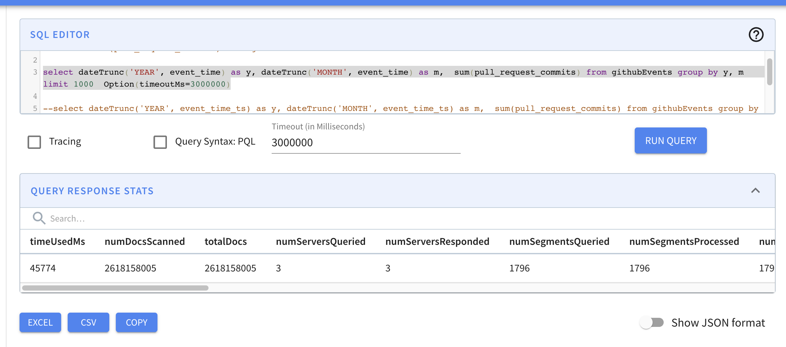
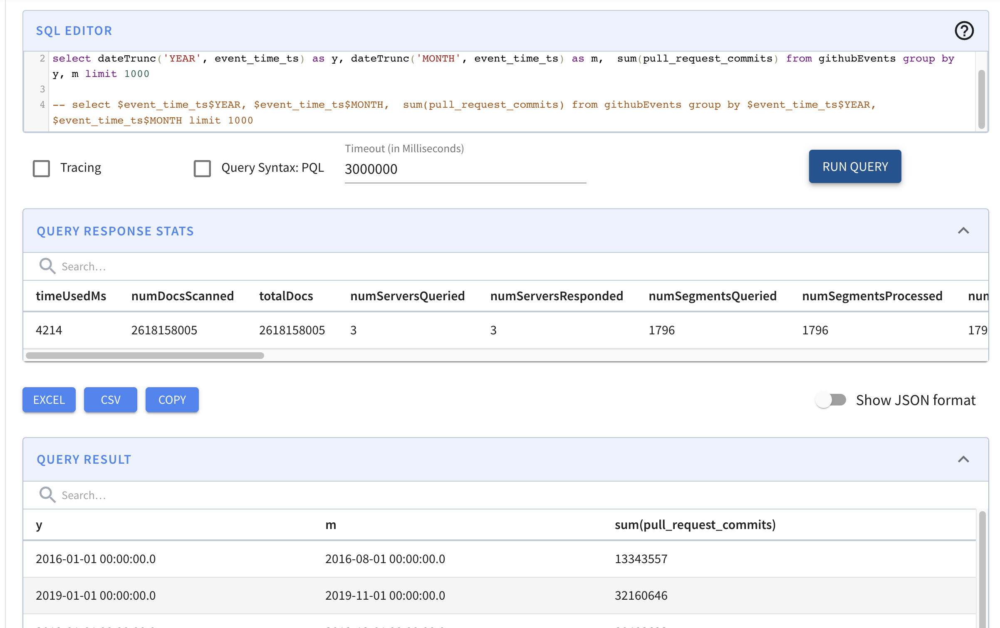

# Timestamp Index


该特性在 Pinot 0.11+ 之后的版本中提供。


Pinot 在 [Pinot 0.8.0 release](https://docs.pinot.apache.org/basics/releases/0.8.0) 之后引入了 TIMESTAMP 数据类型，该数据类型在内部被存储为表示毫秒数 (millisecond epoch) 的 LONG 值。

通常对于分析查询，用户不需要毫秒这么低的粒度，扫描数据和转换时间值对于大数据来说成本很高。

对 TIMESTAMP 列的一个常用的查询模式是在时间范围上过滤，并根据不同的时间粒度（天/月/等）分组。现有的实现要求查询执行器提取值，应用转换函数，然后执行 filter 或 groupBy，不使用字典或索引。因此才有了 **TIMESTAMP 索引** 的灵感，它用于提升 TIMESTAMP 列上范围查询和分组查询的性能。

## 支持的数据类型

TIMESTAMP 索引只可以在 TIMESTAMP 数据类型上创建。

## Timestamp 索引

用户可以为一个 Timestamp 数据类型的列配置最有用的粒度。

1. Pinot 会为每个时间粒度预先生成一个带有正排索引和范围索引的列，使用的命名规范是 `$${ts_column_name}$${ts_granularity}`，例如具有 `DAY`， `MONTH` 粒度的 Timestamp 列 `ts` 会导致生成两个额外的列 `$ts$DAY` 和 `$ts$MONTH`。
2. 查询基于以下规则重写 predicate 和 selection/group：\
   2.1 GROUP BY: 类似于 `dateTrunc('DAY', ts)` 的函数将被转换为使用下面的列 `$ts$DAY` 来获取数据。\
   2.2 PREDICATE: 会为所有粒度的列自动构建范围索引。

查询用法示例：

```sql
select count(*), 
       datetrunc('WEEK', ts) as tsWeek 
from airlineStats 
WHERE tsWeek > fromDateTime('2014-01-16', 'yyyy-MM-dd') 
group by tsWeek
limit 10
```

一些初步的基准测试显示，超过 27 亿条记录的查询性能从 45 秒提高到 4.2 秒。

```sql
select dateTrunc('YEAR', event_time) as y, 
       dateTrunc('MONTH', event_time) as m,  
       sum(pull_request_commits) 
from githubEvents 
group by y, m 
limit 1000
Option(timeoutMs=3000000)
```



vs.



### 如何使用

在表配置的 `fieldConfigList` 字段中配置 Timestamp 索引。用户需要在 `indexTypes` 字段中指定 `TIMESTAMP`；然后在 `timestampConfig` 字段中指定你想要添加索引的时间粒度。

配置示例：

```json
{
  "tableName": "airlineStats",
  "tableType": "OFFLINE",
  "segmentsConfig": {
    "timeColumnName": "DaysSinceEpoch",
    "timeType": "DAYS",
    "segmentPushType": "APPEND",
    "segmentAssignmentStrategy": "BalanceNumSegmentAssignmentStrategy",
    "replication": "1"
  },
  "tenants": {},
  "fieldConfigList": [
    {
      "name": "ts",
      "encodingType": "DICTIONARY",
      "indexTypes": ["TIMESTAMP"],
      "timestampConfig": {
        "granularities": [
          "DAY",
          "WEEK",
          "MONTH"
        ]
      }
    }
  ],
  "tableIndexConfig": {
    "loadMode": "MMAP"
  },
  "metadata": {
    "customConfigs": {}
  },
  "ingestionConfig": {}
}
```
